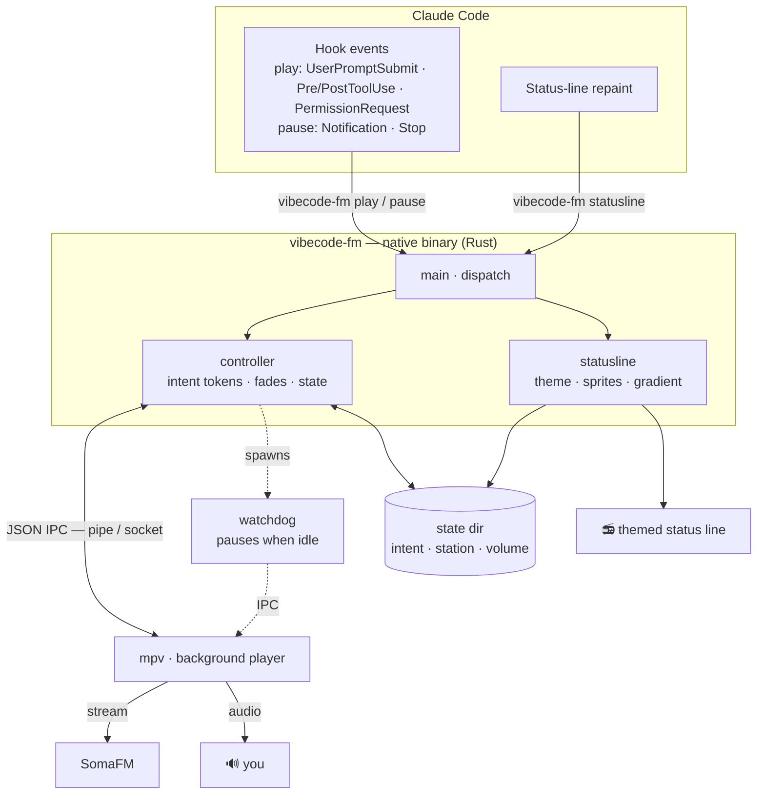

# vibecode.fm

[English](README.md) · [Português](README.pt-BR.md) · **Español**


**Una banda sonora para tu agente de código — suena mientras Claude Code trabaja y se detiene en el instante en que es tu turno.**

Claude empieza a trabajar, la música entra. Te devuelve el turno, la música se detiene. *Escuchas*
cuándo el agente está ocupado y cuándo te necesita, sin estar pegado a la pantalla. Una barra de
estado temática muestra la pista, la estación y el estado — y todo funciona solo.


## Cómo funciona


El plugin conecta los [hooks de Claude Code](https://code.claude.com/docs/en/hooks) con una
instancia de [mpv](https://mpv.io) en segundo plano, a través de su canal JSON IPC:

| Qué ocurre | La música |
|---|---|
| Envías un prompt | ▶ suena |
| Claude ejecuta una herramienta | ▶ suena |
| Aparece un permiso (sí/no) | ▶ sigue sonando |
| Claude termina el turno | ⏸ pausa |
| La sesión termina | ⏸ pausa |

Es un único binario nativo, sin dependencias. Los hooks siempre salen con código 0 y nunca rompen
una sesión; si mpv no está instalado, el plugin simplemente no hace nada, en silencio.

## Arquitectura

Cada evento de Claude Code ejecuta el binario por unos milisegundos; le da órdenes a un mpv en
segundo plano por el socket JSON IPC y termina. Una llamada aparte `statusline` dibuja la línea
temática en cada repintado, y un watchdog ligero pausa la reproducción si la sesión queda inactiva.



## Requisitos

- **[mpv](https://mpv.io)** en tu `PATH`:

```sh
brew install mpv                 # macOS
sudo apt install mpv             # Debian / Ubuntu
winget install shinchiro.mpv     # Windows
```

Eso es todo — sin runtime, sin intérprete. El binario es autónomo. Una sola base de código para
**Windows, macOS, Linux y WSL**; la suite de pruebas corre en los tres en CI.

## Instalación

En Claude Code:

```
/plugin marketplace add GusGaiotti/vibecode.fm
/plugin install vibecode-fm@vibecode-fm
```

Consigue el binario. Descarga el precompilado para tu plataforma desde la
[última release](https://github.com/GusGaiotti/vibecode.fm/releases/latest), o compílalo tú mismo
(necesitas el [toolchain de Rust](https://rustup.rs)):

```sh
cargo build --release        # genera target/release/vibecode-fm
```

Coloca el binario en `bin/vibecode-fm` (o `bin/vibecode-fm.exe` en Windows) dentro del plugin, y
apunta tu barra de estado hacia él (en `settings.json`):

```json
{
  "statusLine": {
    "type": "command",
    "command": "~/.claude/plugins/marketplaces/vibecode-fm/bin/vibecode-fm statusline"
  }
}
```

Envía un prompt y la música arranca.

## Comandos

| Comando | Qué hace |
|---|---|
| `/vibecode-fm:vibe` | Modo DJ — Claude elige la estación que encaja con tu sesión |
| `/vibecode-fm:radio <vibe>` | Cambia a una estación específica |
| `/vibecode-fm:next` | Salta a la siguiente estación |
| `/vibecode-fm:volume <up\|down\|0-100>` | Ajusta el volumen |
| `/vibecode-fm:focus <on\|off>` | On (por defecto): pausa cuando es tu turno. Off: suena sin parar |
| `/vibecode-fm:on` / `:off` | Activa / desactiva el plugin |
| `/vibecode-fm:help` | Referencia de comandos y ajustes |

**Vibes:** chill, ambient, metal, jazz, synthwave, hacker, beats, indie, spy, vaporwave,
space, glitch, tavern, goa, bossa, seventies, reggae, dubstep, lounge, folk — 20 canales
seleccionados de [SomaFM](https://somafm.com) (gratis, legal, sin login), cada uno con sus
propios colores, íconos y frases en la barra de estado. También funcionan sinónimos comunes
(`lofi`, `retro`, `defcon`, `drone`, `hiphop`, `psy`, `agent`…).

## La barra de estado

Muestra la pista actual a la izquierda, sprites temáticos flotando y una frase rotativa en el
centro, y el modelo a la derecha. Los sprites se mueven mientras Claude trabaja y quedan quietos
cuando es tu turno; colores, íconos y frases vienen todos del tema de la estación actual.

¿Prefieres algo más discreto? Configúralo en el bloque `env` de tu `settings.json`:

| Variable | Efecto |
|---|---|
| `VIBECODE_MINIMAL=1` | Solo el ícono y el título |
| `VIBECODE_SPRITES=0` | Quita los sprites (mantiene la frase) |
| `VIBECODE_SPLASH=0` | Quita la frase (mantiene los sprites) |

## Configuración

Todo opcional, vía variables de entorno:

| Variable | Por defecto | Significado |
|---|---|---|
| `VIBECODE_VOLUME` | `70` | Volumen (0–100) |
| `VIBECODE_SOURCE` | playlist incluida | Cualquier archivo, URL o `.m3u` que mpv pueda abrir |
| `VIBECODE_STATIONS` | `~/.vibecode-fm/stations.json` | Tu archivo de estaciones personalizadas |
| `VIBECODE_MPV_BIN` | `mpv` | Ruta a mpv si no está en tu `PATH` |
| `VIBECODE_MPV_ARGS` | — | Flags extra de mpv (ej.: `--ao=pulse` en WSL) |
| `VIBECODE_DEBUG` | off | Registra decisiones y tiempos de los hooks en el directorio de estado |

### Estaciones personalizadas

Agrega las tuyas en `~/.vibecode-fm/stations.json` — una URL simple, o un objeto con etiqueta y
tema de barra de estado:

```json
{
  "focus": "https://stream.example/focus.mp3",
  "night": {
    "url": "https://stream.example/night.mp3",
    "label": "Night Drive",
    "theme": { "stops": [{ "p": 0, "c": [80, 80, 180] }, { "p": 1, "c": [220, 220, 255] }],
               "sprites": ["✦", "★", "·", "♪"] }
  }
}
```

Por defecto suena [SomaFM](https://somafm.com) — se sostiene con donaciones de los oyentes, así que
[considera donar](https://somafm.com/support/) si se vuelve tu banda sonora.

## Limitaciones conocidas

Son restricciones de Claude Code / de la terminal, no bugs — documentadas por honestidad:

- **Ctrl+C no pausa.** Interrumpir un turno no dispara ningún hook, así que el plugin no puede
  reaccionar; la música se pausa en el siguiente turno que termine normalmente.
- **La barra de estado se actualiza al ritmo de repintado de Claude Code**, no bajo demanda, así
  que la transición sonar/pausar puede tardar un instante. La animación de los sprites es basada
  en tiempo por la misma razón — no se puede sincronizar con el audio.
- **Un comando largo que apruebas queda en silencio hasta que termina** — no hay hook para
  "herramienta iniciada tras aprobación", así que la música vuelve cuando la herramienta acaba.
  Las herramientas rápidas vuelven de forma imperceptible. (`/focus off` lo evita al no pausar.)
- **El audio está verificado en Windows.** El código es multiplataforma y la CI pasa en macOS y
  Linux, pero la prueba de audio real ahí está pendiente de la comunidad — reporta problemas.

## WSL

En WSL, mpv suele caer en una salida rota y suena en silencio. Fuerza PulseAudio:

```sh
echo 'export VIBECODE_MPV_ARGS="--ao=pulse"' >> ~/.bashrc
```

## Desarrollo

```sh
cargo test           # pruebas unitarias, sin hardware de audio
cargo fmt --check    # formato
cargo clippy -- -D warnings
```

Ver [CONTRIBUTING.md](CONTRIBUTING.md).

## Licencia

[MIT](LICENSE) © Gustavo Gaiotti
