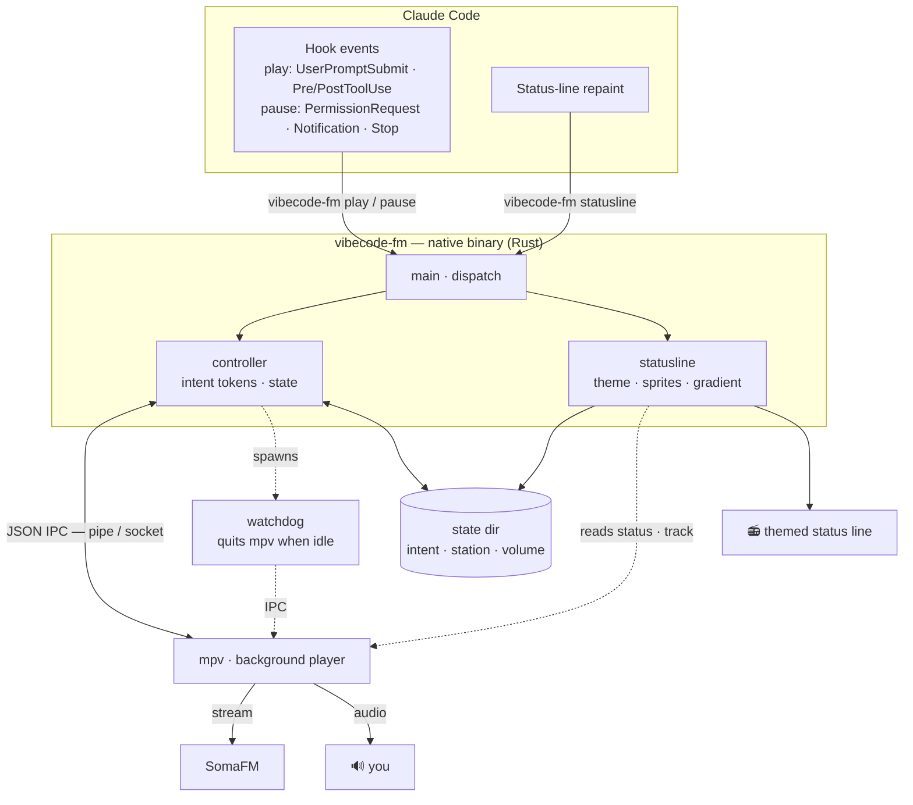

# vibecode.fm

**English** · [Português](README.pt-BR.md) · [Español](README.es.md)


**A soundtrack for your coding agent — plays while Claude Code works, stops the moment it's your turn.**

Claude starts working, the music comes in. It hands the turn back to you, the music stops. You
*hear* when the agent is busy and when it needs you, so you're not glued to the screen. A themed
status line shows the current track, station and state — and it all runs on its own.

## How it works


The plugin wires [Claude Code hooks](https://code.claude.com/docs/en/hooks) to a
background [mpv](https://mpv.io) instance over its JSON IPC channel:

| What happens | The music |
|---|---|
| You submit a prompt | ▶ plays |
| Claude runs a tool | ▶ plays |
| It needs you — a permission prompt, a question, or it goes idle | ⏸ pauses (resumes when you answer) |
| Claude finishes the turn | ⏸ pauses |
| Session ends | ⏸ pauses |

It's a single, dependency-free native binary. Hooks exit 0 no matter what and never break a
session; if mpv isn't installed the plugin does nothing, silently.

## Architecture

Each Claude Code event runs the binary for a few milliseconds; it nudges a background mpv over
its JSON IPC socket and exits. A separate `statusline` call draws the themed line on every
repaint, and a lightweight watchdog quits the background mpv if the session goes idle.



## Requirements

- **[mpv](https://mpv.io)** on your `PATH`:

```sh
brew install mpv                 # macOS
sudo apt install mpv             # Debian / Ubuntu
winget install shinchiro.mpv     # Windows
```

That's it — no runtime, no interpreter. The binary is self-contained. One codebase for
**Windows, macOS, Linux and WSL**; the test suite runs on all three in CI.

## Install

In Claude Code:

```
/plugin marketplace add GusGaiotti/vibecode.fm
/plugin install vibecode-fm@vibecode-fm
```

Get the binary. Either download the prebuilt one for your platform from the
[latest release](https://github.com/GusGaiotti/vibecode.fm/releases/latest), or build it
yourself (needs a [Rust toolchain](https://rustup.rs)):

```sh
cargo build --release        # produces target/release/vibecode-fm
```

Drop the binary at `bin/vibecode-fm` (or `bin/vibecode-fm.exe` on Windows) inside the plugin.

Then turn on the themed status line — no editing `settings.json` by hand:

```
/vibecode-fm:statusline on
```

Restart Claude Code, submit a prompt, and the music starts.

## Commands

| Command | What it does |
|---|---|
| `/vibecode-fm:vibe` | DJ mode — Claude picks the station that fits your session |
| `/vibecode-fm:radio <vibe>` | Switch to a specific station |
| `/vibecode-fm:next` | Skip to the next station |
| `/vibecode-fm:volume <up\|down\|0-100>` | Set the volume |
| `/vibecode-fm:focus <on\|off>` | On (default): pause when it's your turn. Off: play non-stop |
| `/vibecode-fm:minimal <on\|off>` | Status line shows only the track name (no sprites/phrase) |
| `/vibecode-fm:on` / `:off` | Enable / disable the plugin |
| `/vibecode-fm:help` | Command + settings reference |

**Vibes:** chill, ambient, metal, jazz, synthwave, hacker, beats, indie, spy, vaporwave,
space, glitch, tavern, goa, bossa, seventies, reggae, dubstep, lounge, folk — 20 curated
[SomaFM](https://somafm.com) channels (free, legal, no login), each with its own status-line
colours, icons and splash phrases. Common synonyms work too (`lofi`, `retro`, `defcon`,
`drone`, `hiphop`, `psy`, `agent`…).

## The status line

The live track on the left, drifting themed sprites and a rotating splash phrase in the middle,
the model on the right — all from the current station's theme. Want it compact?
`/vibecode-fm:minimal on` shows just the track; `/vibecode-fm:statusline off` hides it entirely.

### Already have a status line?

The music and the status line are independent — the hooks drive playback whether or not you use
vibecode.fm's line. Run `/statusline`, use `ccstatusline`, or keep your own: the music still
works, you just won't see the themed line.

Want both? Embed a compact "now playing" segment in your own status-line script:

```sh
vibecode-fm segment    # e.g. "► Groove Salad · SomaFM"  (prints nothing when stopped)
```

A wrapper that appends it to your existing line:

```sh
printf '%s  %s' "$(my-statusline)" "$(vibecode-fm segment)"
```

## Configuration

All optional, via environment variables:

| Variable | Default | Meaning |
|---|---|---|
| `VIBECODE_VOLUME` | `70` | Volume (0–100) |
| `VIBECODE_SOURCE` | bundled playlist | Any file, URL or `.m3u` mpv can open |
| `VIBECODE_STATIONS` | `~/.vibecode-fm/stations.json` | Your custom stations file |
| `VIBECODE_MPV_BIN` | `mpv` | Path to mpv if it isn't on your `PATH` |
| `VIBECODE_MPV_ARGS` | — | Extra mpv flags |

### Custom stations

Add your own in `~/.vibecode-fm/stations.json` — a plain URL, or an object with a label and
a status-line theme:

```json
{
  "focus": "https://stream.example/focus.mp3",
  "night": {
    "url": "https://stream.example/night.mp3",
    "label": "Night Drive",
    "theme": { "stops": [{ "p": 0, "c": [80, 80, 180] }, { "p": 1, "c": [220, 220, 255] }],
               "sprites": ["✦", "★", "·", "♪"] }
  }
}
```

The default streams [SomaFM](https://somafm.com) — listener-supported, so
[consider donating](https://somafm.com/support/) if it becomes your soundtrack.

## Known limitations

These are Claude Code / terminal constraints, not bugs — documented for honesty:

- **Ctrl+C doesn't pause the music.** Claude Code fires no hook when you interrupt a turn — it
  suspends it silently (there's an open [feature request](https://github.com/anthropics/claude-code/issues/9516)
  for an interrupt hook), and the idle notification that fires after a *normal* turn-end does
  **not** fire after an interrupt. So after Ctrl+C the music keeps playing until the next turn
  ends normally, or until you act — your next prompt resumes and re-pauses it as usual. A plugin
  can't safely pause sooner: only Claude Code can tell "idle" apart from "a long tool running."
- **The status line updates on Claude Code's repaint schedule**, not on demand, so the
  play/pause transition can lag a beat. The sprite animation is time-based for the same
  reason — it can't be synced to the audio.
- **A long command you approve stays quiet until it finishes** — there's no hook for "tool
  started after approval", so the music resumes when the tool ends. Short tools resume
  imperceptibly. (`/focus off` sidesteps this by never pausing.)
- **Audio is only tested on Windows so far.** The code is cross-platform and CI passes on macOS
  and Linux, but real-audio testing there is community-pending — please report issues.

## Development

```sh
cargo test           # unit tests, no audio hardware needed
cargo fmt --check    # formatting
cargo clippy -- -D warnings
```

See [CONTRIBUTING.md](CONTRIBUTING.md).

## License

[MIT](LICENSE) © Gustavo Gaiotti
