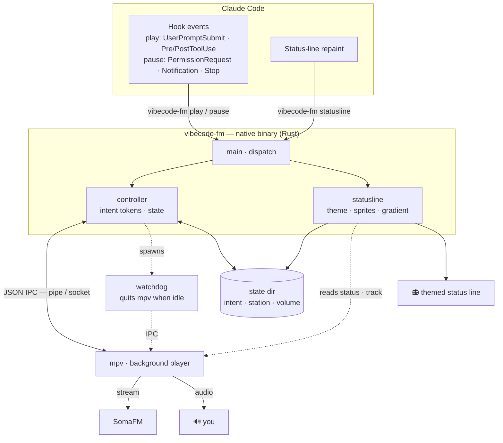

# vibecode.fm

[English](README.md) · **Português** · [Español](README.es.md)


**Uma trilha sonora pro seu agente de código — toca enquanto o Claude Code trabalha e para no instante em que é a sua vez.**

O Claude começa a trabalhar, a música entra. Ele te devolve o turno, a música para. Você *ouve*
quando o agente está ocupado e quando ele precisa de você, sem ficar preso na tela. Uma status
line temática mostra a faixa, a estação e o estado — e tudo roda sozinho.


## Como funciona


O plugin liga os [hooks do Claude Code](https://code.claude.com/docs/en/hooks) a uma instância
do [mpv](https://mpv.io) rodando ao fundo, pelo canal JSON IPC dele:

| O que acontece | A música |
|---|---|
| Você envia um prompt | ▶ toca |
| O Claude roda uma ferramenta | ▶ toca |
| Precisa de você — permissão, uma pergunta, ou ficou ocioso | ⏸ pausa (volta quando você responde) |
| O Claude termina o turno | ⏸ pausa |
| A sessão encerra | ⏸ pausa |

É um único binário nativo, sem dependências. Os hooks sempre saem com código 0 e nunca quebram
uma sessão; se o mpv não estiver instalado, o plugin simplesmente não faz nada, em silêncio.

## Arquitetura

Cada evento do Claude Code roda o binário por alguns milissegundos; ele comanda um mpv em segundo
plano pelo socket JSON IPC e encerra. Uma chamada separada `statusline` desenha a linha temática a
cada repintura, e um watchdog leve encerra o mpv em segundo plano se a sessão ficar ociosa.



## Requisitos

- **[mpv](https://mpv.io)** no seu `PATH`:

```sh
brew install mpv                 # macOS
sudo apt install mpv             # Debian / Ubuntu
winget install shinchiro.mpv     # Windows
```

Só isso — sem runtime, sem interpretador. O binário é autocontido. Uma única base de código para
**Windows, macOS, Linux e WSL**; a suíte de testes roda nos três na CI.

## Instalação

No Claude Code:

```
/plugin marketplace add GusGaiotti/vibecode.fm
/plugin install vibecode-fm@vibecode-fm
```

O binário nativo é baixado automaticamente no primeiro start — o pronto pra sua plataforma da
[última release](https://github.com/GusGaiotti/vibecode.fm/releases/latest), conferido contra o
checksum publicado. Nada mais pra baixar.

Depois ligue a status line temática — sem editar o `settings.json` na mão:

```
/vibecode-fm:statusline on
```

Reinicie o Claude Code, envie um prompt, e a música começa.

> Prefere compilar? Com o [toolchain do Rust](https://rustup.rs), rode `cargo build --release`
> na pasta do plugin e coloque o resultado em `bin/vibecode-fm` (ou `bin/vibecode-fm.exe` no
> Windows) — o auto-download pula o que já estiver lá.

## Comandos

| Comando | O que faz |
|---|---|
| `/vibecode-fm:vibe` | Modo DJ — o Claude escolhe a estação que combina com a sua sessão |
| `/vibecode-fm:radio <vibe>` | Troca pra uma estação específica |
| `/vibecode-fm:next` | Pula pra próxima estação |
| `/vibecode-fm:volume <up\|down\|0-100>` | Ajusta o volume |
| `/vibecode-fm:focus <on\|off>` | On (padrão): pausa quando é a sua vez. Off: toca sem parar |
| `/vibecode-fm:minimal <on\|off>` | Status line mostra só o nome da música (sem sprites/frase) |
| `/vibecode-fm:on` / `:off` | Liga / desliga o plugin |
| `/vibecode-fm:help` | Referência de comandos e configurações |

**Vibes:** chill, ambient, metal, jazz, synthwave, hacker, beats, indie, spy, vaporwave,
space, glitch, tavern, goa, bossa, seventies, reggae, dubstep, lounge, folk — 20 canais
selecionados do [SomaFM](https://somafm.com) (grátis, legal, sem login), cada um com suas
próprias cores, ícones e frases na status line. Sinônimos comuns também funcionam (`lofi`,
`retro`, `defcon`, `drone`, `hiphop`, `psy`, `agent`…).

## A status line

A faixa à esquerda, sprites temáticos flutuando e uma frase rotativa no meio, o modelo à direita
— tudo do tema da estação atual. Quer mais enxuto? `/vibecode-fm:minimal on` mostra só a faixa;
`/vibecode-fm:statusline off` esconde ela por completo.

### Já tem uma status line?

A música e a status line são independentes — os hooks controlam a reprodução usando ou não a
linha do vibecode.fm. Rode `/statusline`, use o `ccstatusline`, ou mantenha a sua: a música
continua funcionando, você só não vê a linha temática.

Quer as duas? Embuta um segmento compacto de "tocando agora" no seu próprio script de status line:

```sh
vibecode-fm segment    # ex.: "► Groove Salad · SomaFM"  (não imprime nada quando parado)
```

Um wrapper que anexa isso à sua linha atual:

```sh
printf '%s  %s' "$(minha-statusline)" "$(vibecode-fm segment)"
```

## Configuração

Tudo opcional, via variáveis de ambiente:

| Variável | Padrão | Significado |
|---|---|---|
| `VIBECODE_VOLUME` | `70` | Volume (0–100) |
| `VIBECODE_SOURCE` | playlist embutida | Qualquer arquivo, URL ou `.m3u` que o mpv abra |
| `VIBECODE_STATIONS` | `~/.vibecode-fm/stations.json` | Seu arquivo de estações customizadas |
| `VIBECODE_MPV_BIN` | `mpv` | Caminho do mpv se ele não estiver no `PATH` |
| `VIBECODE_MPV_ARGS` | — | Flags extras do mpv |

### Estações customizadas

Adicione as suas em `~/.vibecode-fm/stations.json` — uma URL simples, ou um objeto com rótulo e
tema de status line:

```json
{
  "focus": "https://stream.example/focus.mp3",
  "night": {
    "url": "https://stream.example/night.mp3",
    "label": "Night Drive",
    "theme": { "stops": [{ "p": 0, "c": [80, 80, 180] }, { "p": 1, "c": [220, 220, 255] }],
               "sprites": ["✦", "★", "·", "♪"] }
  }
}
```

Por padrão toca o [SomaFM](https://somafm.com) — que se mantém com doações dos ouvintes, então
[considere doar](https://somafm.com/support/) se ele virar sua trilha sonora.

## Limitações conhecidas

São restrições do Claude Code / do terminal, não bugs — documentadas por honestidade:

- **Ctrl+C não pausa a música.** O Claude Code não dispara hook nenhum quando você interrompe um
  turno — ele suspende em silêncio (há um [pedido de feature](https://github.com/anthropics/claude-code/issues/9516)
  aberto pra um hook de interrupção), e a notificação de ocioso que dispara num fim de turno
  *normal* **não** dispara depois de uma interrupção. Então, após Ctrl+C, a música segue tocando
  até o próximo turno terminar normalmente, ou até você agir — seu próximo prompt retoma e pausa
  de novo. Um plugin não consegue pausar antes com segurança: só o Claude Code sabe diferenciar
  "ocioso" de "uma ferramenta longa rodando".
- **A status line atualiza no ritmo de repintura do Claude Code**, não sob demanda, então a
  transição toca/pausa pode atrasar um instante. A animação dos sprites é baseada em tempo pelo
  mesmo motivo — não dá pra sincronizar com o áudio.
- **Um comando longo que você aprova fica em silêncio até terminar** — não há hook pra "ferramenta
  iniciou após aprovação", então a música volta quando a ferramenta acaba. Ferramentas rápidas
  voltam de forma imperceptível. (`/focus off` contorna isso nunca pausando.)
- **O áudio só foi testado no Windows por enquanto.** O código é cross-platform e a CI passa no
  macOS e no Linux, mas o teste de áudio real nesses sistemas está pendente da comunidade — reporte problemas.

## Desenvolvimento

```sh
cargo test           # testes unitários, sem precisar de hardware de áudio
cargo fmt --check    # formatação
cargo clippy -- -D warnings
```

Veja [CONTRIBUTING.md](CONTRIBUTING.md).

## Licença

[MIT](LICENSE) © Gustavo Gaiotti
